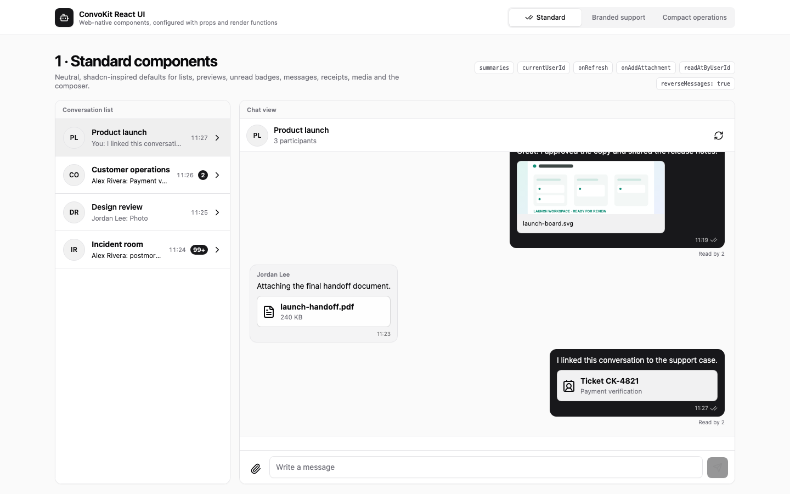
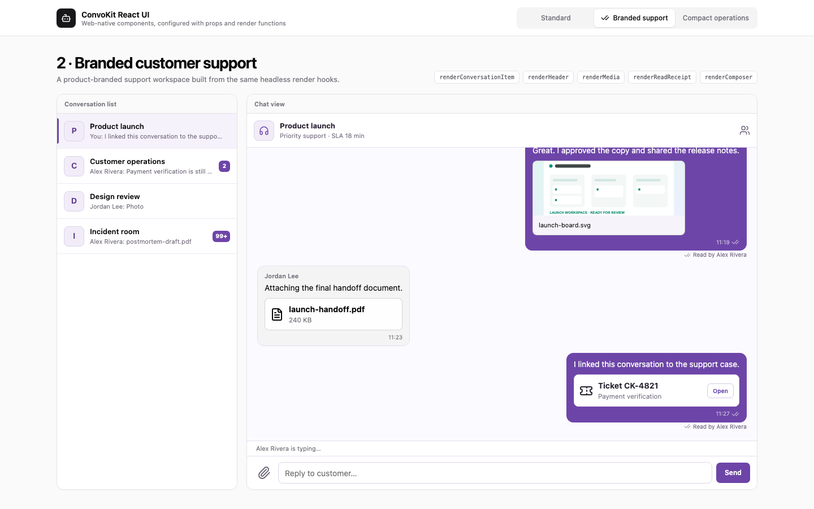
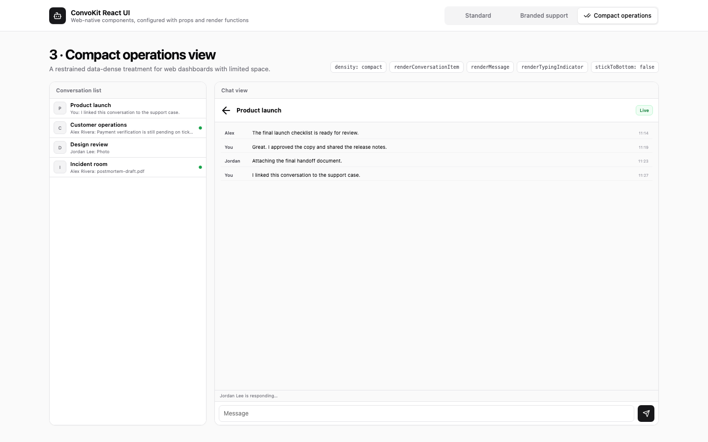

# ConvoKit React UI examples

Public, runnable examples showing how an application can configure
[`@convokitapp/react-ui`](https://www.npmjs.com/package/@convokitapp/react-ui)
without copying or modifying the package source.

This repository contains application code only. It depends on the published
React UI package and the core [`@convokitapp/sdk`](https://www.npmjs.com/package/@convokitapp/sdk).

## Live open-chatroom demo

This example consumes the published 0.8.0 core and UI packages. The SDK-backed
conversation list pages the activity-ordered inbox, shows each room's latest-message
preview, activity time and unread badge, and refreshes on room/membership/activity
signals; pending messages are replaced when their matching live/history confirmation
arrives. The room bar's **Mark unread** action calls the list controller's
`markUnread(conversationId)` (obtained through `onControllerChange`): the package
sets the viewer's private marker, patches that row's summary and renders a numberless
dot when nothing is actually unread, and the demo returns to the inbox. Reopening the
room acknowledges it with the private state version captured at that open, which
clears the marker; other members never see it, and a second device picks it up
through the inbox activity signal. Your own confirmed messages offer the package's
**Edit message** / **Delete message** actions (revealed on hover or focus with a mouse,
always visible on touch): editing turns the composer into an edit banner that saves
through the SDK's author route with the revision you saw, so a message someone else
edited first answers a conflict that reloads the row and keeps your text; deleting asks
the inline `Delete this message?` confirmation and removes the row for every member
once the server confirms. Rows whose content changed carry an `Edited` label derived
from the message's `revision`. The demo passes nothing about editing: the bound
`Conversation` wires its controller (`editingMessage`, `startEditing`, `saveEdit`,
`cancelEditing`, `deleteMessage`) itself. No demo-side polling, preview/unread
bookkeeping, text matching, revision bookkeeping or duplicate-bubble workaround is
required.

[Open the React demo](https://convokit-react-demo.vercel.app). It uses the same backend, demo personas and
room IDs as the [Flutter demo](https://convokit-open-chatroom.vercel.app).
The default page is now the real SDK-backed app; no environment variables are
required to try the shared demo.

- Choose Maya, Alex, Sam or Taylor, or enter your own demo user ID.
- Create a conversation and copy its room ID, or join an existing room by ID.
- Open another framework/device with a different persona to test messages,
  typing, read receipts, images and files. Attachments are limited to 20 MB.
- Open a room and choose **Mark unread** to flag it for later; the same persona on
  another device sees the dot without opening the room, and opening it clears it.
- Hover or focus one of your own messages to **Edit** or **Delete** it; the other
  device sees the new text with an `Edited` label, or the row disappearing, without a
  reload. Edit the same message from both devices to see the conflict handling: the
  second save reloads the row, keeps your draft, and saves on the next attempt.
  Deleting cannot be undone, and files already received or downloaded cannot be retracted.
- Reload restores the user and selected room. Switch user ends that SDK session.
- The inbox and chat are the published UI package's components/controllers.
  App code only supplies branding, the demo identity/room flow and upload/download hooks.

This is deliberately an **open testing environment**. Anyone who knows a room ID
can join. Do not post confidential information. No client secret is bundled into
these public apps; it stays in the existing server-side token/join broker.

## Component showcase

The offline showcase uses local fixture data. Start the app and open
\`?mode=showcase\` to use it without connecting to a backend:

```bash
npm install
npm run dev
```

Use the selector to compare configurations, or open `?variant=standard`,
`?variant=branded`, or `?variant=compact` directly.

### Standard components



Web-native, shadcn-inspired package defaults plus inbox previews and unread badges
from `summaries`/`currentUserId` (a numberless dot for a room marked unread with a
count of 0), refresh, attachment, read-position, image/file rendering, own-message
**Edit message** / **Delete message** actions with the inline delete confirmation, the
composer's edit banner and the `Edited` label, and bottom-anchored messages. The
controlled `ConversationView` gets `editingMessage`, `onEditMessage`, `onSaveEdit`,
`onCancelEdit` and `onDeleteMessage` from a small fixture room (a save bumps the
row's `revision`, a delete removes it and the inbox preview follows the newest
surviving row); leave those props out and no action renders.

### Branded customer support



A restrained product-branded support workspace built with `renderConversationItem` (reading the
row's `summary` and `currentUserId`, including the `isUnread` dot rule), `renderHeader`,
`renderMedia`, `renderReadReceipt`, and `renderComposer`. The custom composer renders its own
banner from the `editing` render prop and calls the same `send` to save; the package's default
rows keep their edit/delete actions.

### Compact operations



A dense dashboard built with `density="compact"`, custom rows, message lines,
typing state, composer, and `stickToBottom={false}`. The custom message line renders the
`isEdited` flag and the `edit` / `remove` actions it receives (present exactly when the
viewer may act on that row); `remove` goes through the view's `confirmDelete`, so the
host's own dialog replaces the inline confirmation.

The complete configuration is in [`src/ShowcaseApp.tsx`](src/ShowcaseApp.tsx).

## Live SDK-backed example

To use your own app instead of the shared demo, override all matching public
frontend settings (`?mode=live` remains supported):

```bash
VITE_CONVOKIT_CLIENT_ID=public-client-id
VITE_CONVOKIT_TOKEN_ENDPOINT=https://app.example.com/api/convokit-token
VITE_CONVOKIT_JOIN_ENDPOINT=https://app.example.com/api/chatrooms
```

The managed `https://api.convokit.app` endpoint is automatic. Optionally set
`VITE_CONVOKIT_BACKEND_URL` only for local testing or self-hosting.

The token endpoint runs on your backend and must authenticate the host user.
It can return `{ token }` or `{ data: { token } }`. The join endpoint receives
`POST /:roomId/join` with `{ appUserId, displayName }`; your backend must authorize
membership before the UI opens the room. Replace this open-demo policy in a real product.
Never expose the ConvoKit client secret in a React application or Vite variable.

## Verification

```bash
npm ci
npm run validate
```

## Vercel deployment

The checked-in `vercel.json` builds this Vite app and supports direct navigation.
The production build rejects insecure/localhost API or broker endpoints. Local
loopback overrides are accepted only by the development build.

```bash
npm ci
npm run validate
vercel link --project convokit-react-demo --team techpools-projects
vercel deploy --prod
```

Shared live demos: [React](https://convokit-react-demo.vercel.app) ·
[Vue](https://convokit-vue-demo.vercel.app) ·
[Flutter](https://convokit-open-chatroom.vercel.app).
